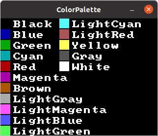
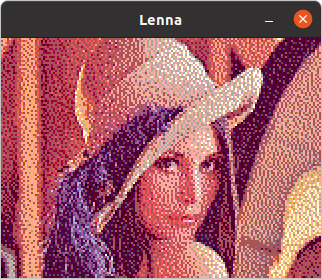
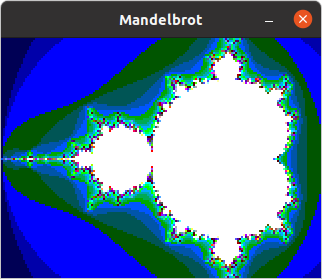
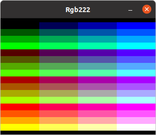

SDL2NovaVGA
===========

SDL2NovaVGA is a reimplementation of the NovaVGA Arduino Library. SDL2NovaVGA
uses [SDL](https://www.libsdl.org/) to render simulated
[NovaVGA](https://www.micro-nova.com/novavga) graphics output on Linux and other
supported platforms.

Examples
--------

The original NovaVGA Arduino Library is Copyright :copyright: 2015 MicroNova, LLC.
